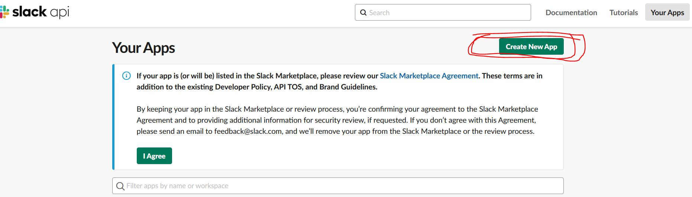
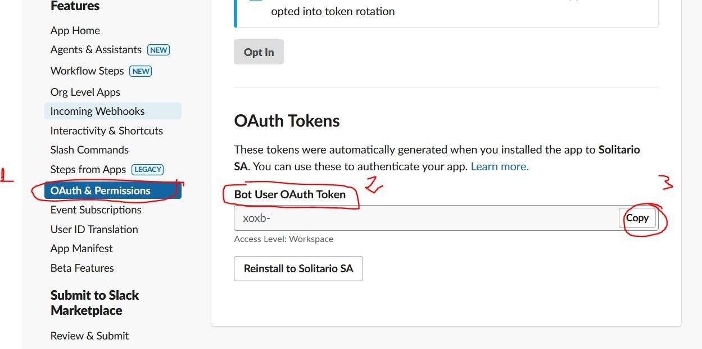
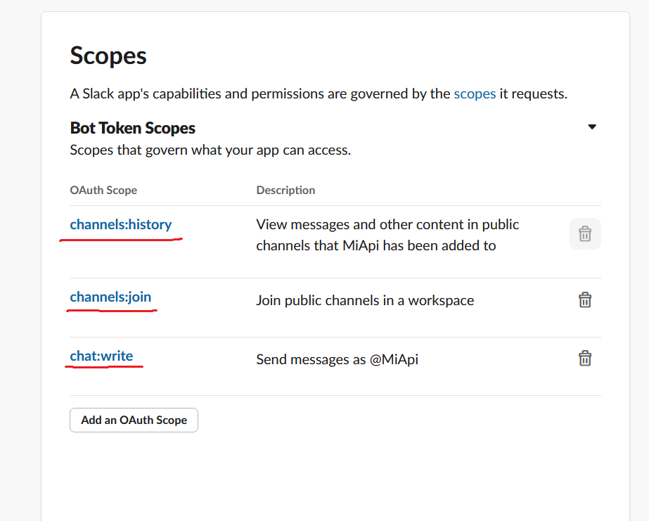
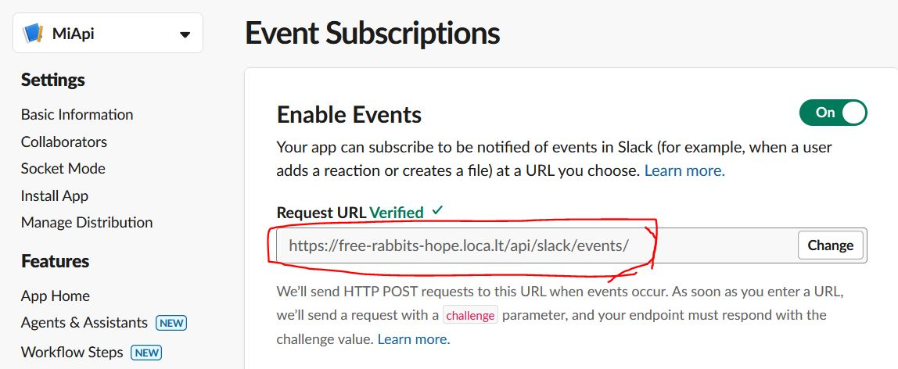
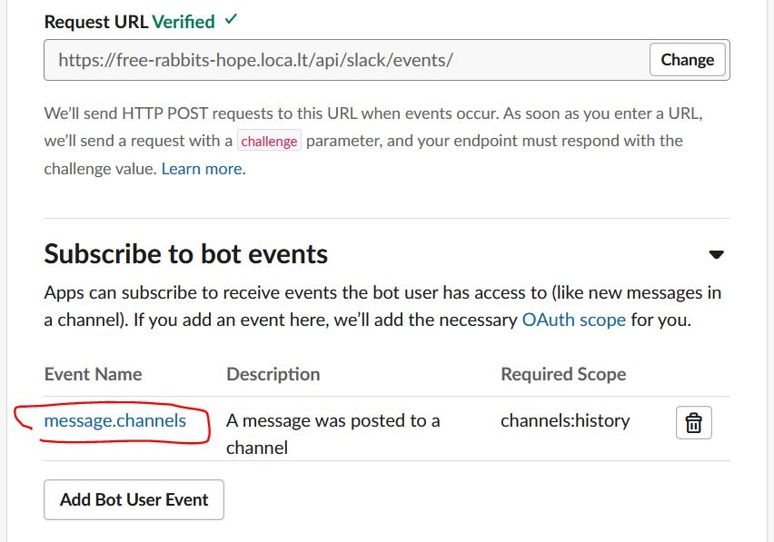
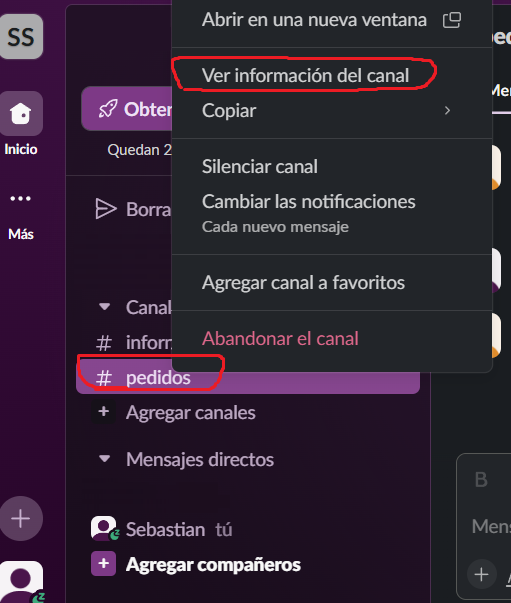
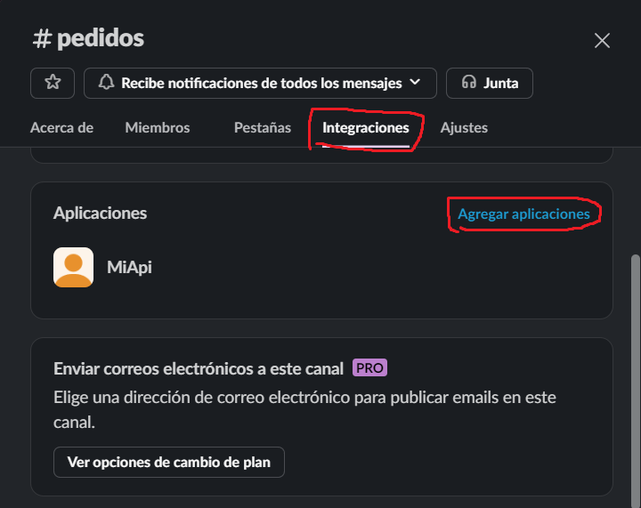

# Prueba tecnica 

El objetivo es crear una aplicacion fullstack compuesta del framework  Django Rest como backend, PostgreSQL como Base de datos relacional y Angular como framework de frontend
&nbsp;

 - [Preliminares](#preliminares)
 - [Instalar aplicaciones en Ubuntu](#instalar-aplicaciones-en-ubuntu)
 - [Crear base de datos](#crear-base-de-datos)
 - [Slack bot](#slack-bot)
 - [Configurar proyecto Django](#configurar-proyecto-django)
 - [Puesta en marcha en localhost](#puesta-en-marcha-en-localhost)

&nbsp;

## Preliminares

Descargar este repositorio 

## Instalar aplicaciones en Ubuntu

Abrir la terminal, instalar python y susdependencias

	sudo apt install python3 python3-pip python3-venv build-essential libpq-dev -y

Crear un entorno virtual (en este ejemplo es: myenv)

	python3 -m venv myenv 

Activar el entorno virtual 

	source myenv/bin/activate

Instalar modulos en **myenv**

    pip install -r requirements.txt

o ejecutar la siguiente linea de codigo

	pip install asgiref==3.8.1 certifi==2024.8.30  charset-normalizer==3.3.2 Django==4.2.3 djangorestframework==3.15.2 idna==3.10 psycopg2-binary requests==2.32.3 slack_sdk==3.33.1 sqlparse==0.5.1 typing_extensions==4.12.2 tzdata==2024.2 urllib3==2.2.3 celery django-celery-beat

Instalar PostgreSQL (para la base de datos)

	sudo apt install postgresql postgresql-contrib

Instalar Node.js v20 (para usar localtunnel)

    curl -o- https://raw.githubusercontent.com/nvm-sh/nvm/v0.40.0/install.sh | bash
	nvm install 20
	node -v # should print `v20.17.0`
	npm -v # should print `10.8.2`

Instalar localtunnel (para redireccionar localhost:8000 a una URL)

    npm install -g localtunnel

Instalar redis para almacenar las tareas asíncronas

	sudo apt-get install redis

## Crear base de datos

Cambiar al usuario postgres y entrar en la consola psql
	
	sudo -i -u postgres
    psql

Crear la base de datos del proyecto (en este ejemplo es: restaurantdb)

	CREATE DATABASE restaurantdb;

(Opcional) Cambiar la contraseña del usuario postgres

	ALTER USER postgres WITH PASSWORD '123';

## Slack Bot

Activar el redireccionamiento del puerto 8000 a una URL con localtunnel

	lt --port 8000

Localtunnel redirecciona a una URL del tipo: https://xxxx-yyyy-zzzz.loca.lt

Con un workspace en Slack ya creado, crear una app que se conectará con el backend de Django. Click en **Create New App -> From Scratch** enlazar al workspace deseado, y dar un nombre  (en este ejemplo es: MiApi)

En las configuraciones de la App, en OAuth & Permissions, copiar el token **Bot User OAuth Token**

en Scopes habilitar los siguientes alcances **channels:history, channels:join y chat:write**

Para que Slack envie los mensajes enviados al grupo destino en Slack 
se debe registrar la URL donde Slack enviará los mensajes en el campo **Request URL** en la seccion **Events Suscriptions**

Luego suscribir el bot al evento de **message.channels**

En la aplicacion de escritorio de Slack se busca el canal que el bot escuchará (en el ejemplo: pedidos)

Se agrega la aplicacion creada "MiApi".
Con esto MiApi sera capaz de escuchar los mensajes que se envien en el canal de pedidos

## Configurar proyecto Django

En **restaurant/settings.py** cambiar los valores en la base de datos (si corresponde)

    #restaurant/settings.py
	DATABASES = {
        'default': {
            'ENGINE': 'django.db.backends.postgresql_psycopg2',
            'NAME': 'restaurantdb', 
            'USER': 'postgres',
            'PASSWORD': '123',
            'HOST': 'localhost', 
            'PORT': '5432',
        }
    }

En **api/views.py** se cambia **SLACK_BOT_TOKEN** y **CHANNEL** por el token del Slack Bot y el canal donde escuchará respectivamente

	#api/views.py
	SLACK_BOT_TOKEN=mi_token_aqui
	CHANNEL='#pedidos'

## Puesta en marcha en localhost

Se ejecutan los procesos de redis y celery para tareas programadas (nombre del proyecto: restaurant)

	sudo systemctl enable redis
	sudo systemctl start redis
	celery -A restaurant worker --loglevel=info
	celery -A restaurant beat --loglevel=info

Se hacen las migraciones y se ejecutan (asegurese de estar en el entorno virtual)

	python manage.py makemigrations
	python manage.py migrate

Finalmente, se corre Django en el puerto 8000
	
	python manage.py runserver
